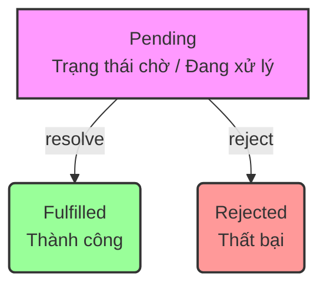

# Câu A1 (5đ) — Sync vs Async

## 1. Thứ tự Output dự đoán

Dưới đây là kết quả in ra màn hình console theo đúng thứ tự:

1. `1 - Start`
2. `4 - End`
3. `3 - Promise`
4. `6 - Promise 2`
5. `2 - Timeout 0ms`
6. `7 - Nested timeout`
7. `5 - Timeout 100ms`

---

## 2. Giải thích cơ chế Event Loop, Microtask Queue và Macrotask Queue

Để hiểu tại sao code chạy ra thứ tự trên, chúng ta cần hiểu cách JavaScript xử lý bất đồng bộ thông qua **Event Loop**:

* **Call Stack (Ngăn xếp tiếng gọi):** Nơi chứa các hàm đang được thực thi đồng bộ (Sync). JavaScript là đơn luồng (single-threaded), nên nó sẽ chạy hết toàn bộ code đồng bộ trong Call Stack trước.
* **Microtask Queue (Hàng đợi vi tác vụ):** Chứa các tác vụ ưu tiên cao, phổ biến nhất là các callback của **Promise (`.then`, `.catch`, `.finally`)**, `async/await`, hoặc `MutationObserver`.
* **Macrotask Queue / Callback Queue (Hàng đợi đại tác vụ):** Chứa các tác vụ bất đồng bộ thông thường như **`setTimeout`**, `setInterval`, `setImmediate`, hoặc các sự kiện DOM (click, scroll...).

### Quy tắc hoạt động của Event Loop:
1. Chạy toàn bộ các dòng code đồng bộ (Synchronous) trong **Call Stack**.
2. Kiểm tra và thực hiện **TẤT CẢ** các tác vụ có trong **Microtask Queue** cho đến khi hàng đợi này trống rỗng.
3. Lấy **MỘT (1)** tác vụ đứng đầu từ **Macrotask Queue** ra thực thi.
4. Quay lại bước 2 (lặp đi lặp lại liên tục).

---

## 3. Phân tích từng bước chạy của đoạn code (Step-by-Step)

### Bước 1: Chạy code đồng bộ (Call Stack)
* Chạy `console.log("1 - Start")` $\rightarrow$ **In ra: `1 - Start`**.
* Gặp `setTimeout(..., 0)` $\rightarrow$ Đẩy callback (in ra số 2) vào **Macrotask Queue** (đặt tên là `Macro_2`).
* Gặp `Promise.resolve().then(...)` $\rightarrow$ Đẩy callback (in ra số 3) vào **Microtask Queue** (đặt tên là `Micro_3`).
* Chạy `console.log("4 - End")` $\rightarrow$ **In ra: `4 - End`**.
* Gặp `setTimeout(..., 100)` $\rightarrow$ Web APIs đếm ngược 100ms trước khi đẩy callback (in ra số 5) vào Macrotask Queue về sau.
* Gặp `Promise.resolve().then(...)` $\rightarrow$ Đẩy callback chứa số 6 và số 7 vào **Microtask Queue** (đặt tên là `Micro_6_7`).

> **Trạng thái hiện tại:**
> * *Console đã in:* `1 - Start` $\rightarrow$ `4 - End`
> * *Microtask Queue:* `[Micro_3, Micro_6_7]`
> * *Macrotask Queue:* `[Macro_2]` (và `Macro_5` đang chờ đếm ngược 100ms)

### Bước 2: Quét sạch Microtask Queue
Event Loop thấy Call Stack trống, nó sẽ ưu tiên chạy hết Microtask Queue:
* Chạy `Micro_3` $\rightarrow$ **In ra: `3 - Promise`**.
* Chạy `Micro_6_7` $\rightarrow$ **In ra: `6 - Promise 2`**. Lúc này bên trong hàm lại gặp `setTimeout(..., 0)`, callback này được đẩy ngay vào cuối **Macrotask Queue** (đặt tên là `Macro_7`).

> **Trạng thái hiện tại:**
> * *Console đã in:* `1 - Start` $\rightarrow$ `4 - End` $\rightarrow$ `3 - Promise` $\rightarrow$ `6 - Promise 2`
> * *Microtask Queue:* `[]` (Trống)
> * *Macrotask Queue:* `[Macro_2, Macro_7]`

### Bước 3: Chạy các tác vụ trong Macrotask Queue
Vì Microtask đã trống, Event Loop lấy **tác vụ đầu tiên** của Macrotask Queue lên thực thi:
* Chạy `Macro_2` $\rightarrow$ **In ra: `2 - Timeout 0ms`**.
* Sau khi chạy xong `Macro_2`, Event Loop lại check Microtask (vẫn trống), nên lấy tiếp tác vụ tiếp theo trong Macrotask:
* Chạy `Macro_7` $\rightarrow$ **In ra: `7 - Nested timeout`**.

### Bước 4: Tác vụ trễ (sau 100ms)
* Sau khi đủ 100ms, callback của `setTimeout(..., 100)` mới được đẩy vào Macrotask Queue và Event Loop lôi nó lên chạy $\rightarrow$ **In ra: `5 - Timeout 100ms`**.

## Câu A2 (5đ) — Fetch API

### Trả lời câu hỏi chi tiết

#### 1. `await fetch(...)` — `fetch` trả về gì? Tại sao cần `await`?
* **`fetch()` trả về gì:** Trả về một **`Promise`**, bên trong chứa đối tượng **`Response`** (bao gồm HTTP headers, status, và luồng dữ liệu body thô).
* **Tại sao cần `await`:** Vì gửi request qua internet là tác vụ bất đồng bộ cần thời gian phản hồi. Từ khóa `await` bắt JavaScript đợi cho đến khi server phản hồi xong để giải nén (resolve) `Promise` thành đối tượng `Response` thực tế, giúp lập trình viên lấy dữ liệu trực tiếp thay vì nhận một Promise đang chờ (`pending`).

#### 2. `response.ok` — Khi nào `false`? Liệt kê 3 status codes tương ứng.
* Thuộc tính `response.ok` trả về `false` khi HTTP status code của phản hồi **không** nằm trong dải thành công `200 - 299`.
* **3 status codes tương ứng phổ biến:**
  * **`404`** (Not Found) — Không tìm thấy tài nguyên/đường dẫn yêu cầu.
  * **`500`** (Internal Server Error) — Lỗi hệ thống phát sinh từ phía server.
  * **`403`** (Forbidden) — Yêu cầu bị từ chối do client không có quyền truy cập.

#### 3. `response.json()` — Tại sao cần `await` lần nữa?
* Sau khi `fetch()` xong, trình duyệt mới chỉ nhận được phần **Headers** của phản hồi. Phần nội dung thực tế (**Body**) vẫn đang được truyền về dưới dạng một luồng dữ liệu thô (Stream).
* Hàm `response.json()` có nhiệm vụ đọc toàn bộ luồng dữ liệu đó và ép kiểu (parse) từ chuỗi định dạng JSON sang đối tượng JavaScript. Việc đọc stream lớn này tốn thời gian nên bản thân `response.json()` cũng là một tác vụ bất đồng bộ trả về một `Promise`, vì vậy bắt buộc phải có `await` lần hai.

#### 4. `try...catch` — Catch những lỗi gì? (Network error? 404? JSON parse error?)
Khối `catch` trong đoạn code trên sẽ bắt trọn tất cả các lỗi sau:
* **Có bắt được Network error:** **Có.** Nếu thiết bị mất mạng, đứt cáp, hoặc sai DNS, `fetch()` sẽ lập tức bị reject và luồng chạy nhảy thẳng vào khối `catch`.
* **Có bắt được lỗi 404 / 500 không:** Bản thân `fetch()` không tự coi 404/500 là lỗi nghiêm trọng. Tuy nhiên, nhờ dòng code kiểm tra chủ động `if (!response.ok) { throw new Error(...) }`, các lỗi này **bị ép buộc** ném ra ngoại lệ (`throw`) và sẽ nhảy vào khối `catch`.
* **Có bắt được JSON parse error:** **Có.** Nếu server trả về dữ liệu lỗi không đúng định dạng JSON (như trả về một trang HTML lỗi hoặc chuỗi trống), hàm `response.json()` sẽ bị lỗi cú pháp (`SyntaxError`), khối `catch` sẽ bắt được lỗi này.

## Câu A3 (5đ) — Promise States

### 1. Sơ đồ 3 trạng thái của Promise

Vì đây là file Markdown, bạn có thể sử dụng sơ đồ dạng chữ (Mermaid) dưới đây. GitHub hỗ trợ hiển thị sơ đồ này cực kỳ đẹp mắt:

